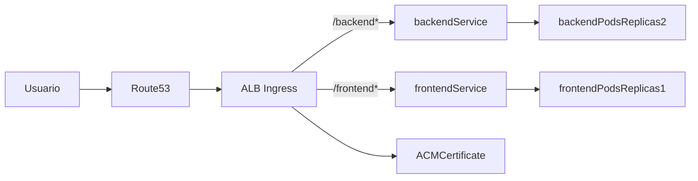

# Plano de Implementação AWS (EKS + Domínio Real)

## Arquitetura alvo

- Rodar `backend` e `frontend` em pods separados no EKS.
- Expor ambos por um único ALB com roteamento por path:
  - `https://meudominio.com/backend` -> serviço backend
  - `https://meudominio.com/frontend` -> serviço frontend
- Garantir backend com `replicas: 2` para atender requisito do desafio.
- Gerenciar DNS no Route53 e TLS no ACM.

## Etapa 1 - Preparar aplicações para path-based routing

- Garantir backend com CRUD completo de usuários:
  - `POST /users` (Create)
  - `GET /users` e `GET /users/{id}` (Read)
  - `PUT /users/{id}` ou `PATCH /users/{id}` (Update)
  - `DELETE /users/{id}` (Delete)
- Implementar endpoint de `Update` no backend Go e validar comportamento (200/404/500).
- Ajustar frontend Flask para funcionar atrás de prefixo `/frontend` e chamar backend via `/backend` (evitar acoplamento a host/porta internos).
- Manter backend respondendo endpoints REST; opcionalmente adicionar suporte a prefixo `/backend` no Ingress sem mudar handlers do Go.
- Validar localmente com Docker antes da infra cloud.

Arquivos base para esta etapa:
- [devsecops/frontend/src/frontend/frontend.py](devsecops/frontend/src/frontend/frontend.py)
- [devsecops/frontend/src/frontend/templates/index.html](devsecops/frontend/src/frontend/templates/index.html)
- [devsecops/backend/main.go](devsecops/backend/main.go)
- [devsecops/frontend/Dockerfile](devsecops/frontend/Dockerfile)
- [devsecops/backend/Dockerfile](devsecops/backend/Dockerfile)

## Etapa 2 - Infraestrutura AWS com Terraform

- Criar stack Terraform com:
  - VPC (subnets públicas/privadas, NAT, IGW)
  - EKS cluster + node group
  - IAM OIDC provider e IAM roles para service accounts
  - ECR para imagens `frontend` e `backend`
  - Route53 hosted zone/records
  - ACM certificate (DNS validation)
- Separar módulos para facilitar manutenção (`network`, `eks`, `ecr`, `dns`, `acm`).

Estrutura sugerida:
- `infra/terraform/environments/dev/`
- `infra/terraform/modules/network/`
- `infra/terraform/modules/eks/`
- `infra/terraform/modules/ecr/`
- `infra/terraform/modules/dns/`
- `infra/terraform/modules/acm/`

## Etapa 3 - Deploy no Kubernetes

- Criar manifests/Helm chart para:
  - `Deployment` backend com `replicas: 2`
  - `Deployment` frontend com `replicas: 1`
  - `Service` para cada app
  - `Ingress` com AWS Load Balancer Controller (ALB) + regras de path
- Configurar health checks:
  - backend: `/healthz`
  - frontend: `/healthz`
- Configurar variáveis/env para integração frontend-backend.

Estrutura sugerida:
- `infra/k8s/base/backend-deployment.yaml`
- `infra/k8s/base/frontend-deployment.yaml`
- `infra/k8s/base/backend-service.yaml`
- `infra/k8s/base/frontend-service.yaml`
- `infra/k8s/base/ingress.yaml`
- `infra/k8s/base/namespace.yaml`

## Etapa 4 - CI/CD (build + push + deploy)

- Pipeline GitHub Actions com jobs:
  - lint/test básico
  - build e push imagens para ECR
  - apply Terraform (ambiente alvo)
  - deploy manifests no EKS (`kubectl`/Helm)
- Estratégia por branch:
  - `main`: deploy em ambiente principal
  - feature branches: validação sem apply em produção

Arquivo sugerido:
- `.github/workflows/deploy.yml`

## Etapa 5 - Validação final do desafio

- Verificar endpoints públicos:
  - `https://meudominio.com/frontend`
  - `https://meudominio.com/backend/healthz`
- Confirmar distribuição entre 2 réplicas do backend via logs/metrics.
- Testar rollback e reaplicação idempotente do Terraform.
- Documentar passo a passo de setup e operação.

## Critérios de aceite

- Backend em 2 réplicas atrás de ALB.
- Backend expõe CRUD completo (Create, Read, Update, Delete) para usuários.
- Frontend e backend no mesmo domínio com paths distintos.
- DNS resolvendo corretamente para ALB.
- Certificado TLS válido via ACM.
- Provisionamento e deploy automatizados por pipeline.
- Documentação de execução em dev e produção.
